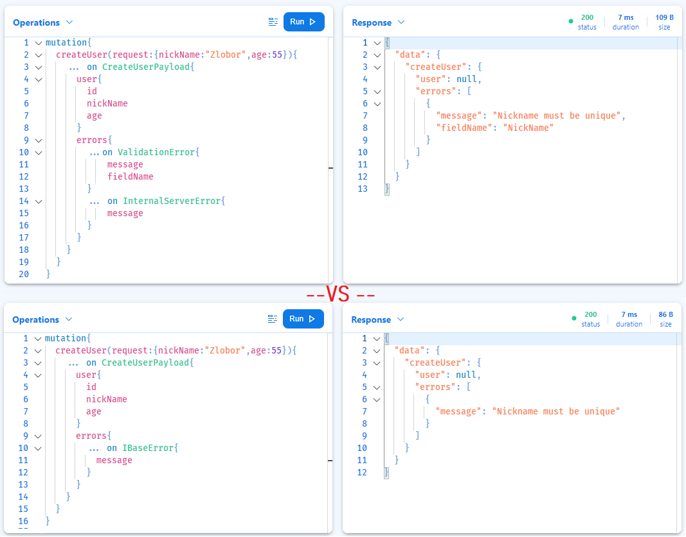

## About

Dealing with errors in Graphql is a topic on which there are numerous articles and recommendations, but there are not many real-world examples of how to implement a concrete approach under a given language and GraphQL server.

**This repo is related to article:** [GraphQL mutation union erros (6a) with Hotchocolate GraphQL Server](https://github.com/damikun/hotchocolate-mutation-errors/blob/main/Doc/MutationErrors.md#repository) or [Opensource FullStack App Example](https://github.com/damikun/trouble-training).

It provides implementation of **stage 6a** mutation error handling from *Marc-Andre Giroux* [Guide to graphql errors](https://productionreadygraphql.com/2020-08-01-guide-to-graphql-errors) under **Hotchocolate** (.Net) GraphQL Server including some base integration with MediatR.

These are the advantages of the 6a approach:
✅Pro: Expressive and Discoverable Schema
✅Pro: Support for Multiple Errors
✅Pro: Easier Evolution

Before we begin, let me show you an example from the playground of **6a** error. The pattern allows you to choose whether to use one concrete type as the `union` or group them all together using the common `IBaseError` interface:

### Content

- [GraphQL Errors](https://github.com/damikun/hotchocolate-mutation-errors/blob/main/Doc/MutationErrors.md#graphql-errors)
- [Mutation Errors](https://github.com/damikun/hotchocolate-mutation-errors/blob/main/Doc/MutationErrors.md#mutation-errors)
- [Stage 6a Integration](https://github.com/damikun/hotchocolate-mutation-errors/blob/main/Doc/MutationErrors.md#stage-6a-integration)
    - [Abstraction](https://github.com/damikun/hotchocolate-mutation-errors/blob/main/Doc/MutationErrors.md#stage-6a-integration)
        - [Validation errors](https://github.com/damikun/hotchocolate-mutation-errors/blob/main/Doc/MutationErrors.md#validation-errors)
        - [Authorization errors](https://github.com/damikun/hotchocolate-mutation-errors/blob/main/Doc/MutationErrors.md#authorization-errors)
    - [Hotchocolate integration](https://github.com/damikun/hotchocolate-mutation-errors/blob/main/Doc/MutationErrors.md#hotchocolate-integration)
- [Demo UI](https://github.com/damikun/hotchocolate-mutation-errors/blob/main/Doc/MutationErrors.md#hotchocolate-integration)
- [Repository](https://github.com/damikun/hotchocolate-mutation-errors/blob/main/Doc/MutationErrors.md#repository)

### Opensource workshop

https://github.com/damikun/trouble-training

This open source fullstack WorkShop shows an example WebHook application with a self-hosted IdentityServer and guides you on how to set up distributed tracing and monitoring for your app.
